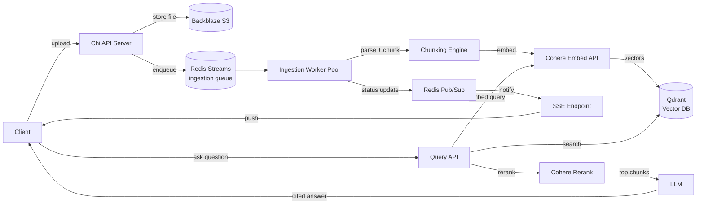
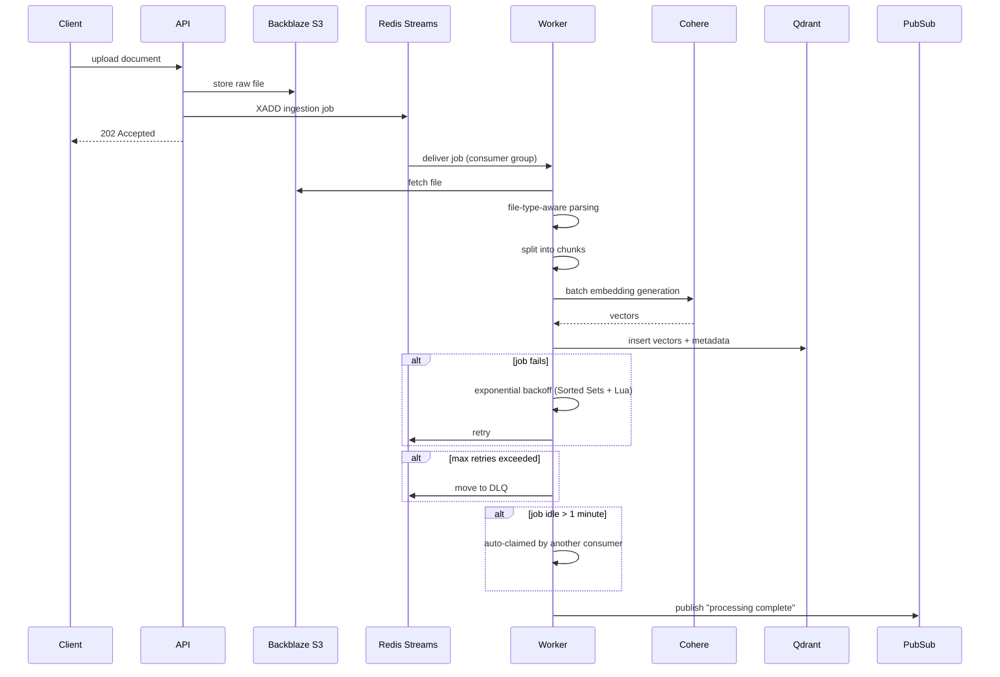
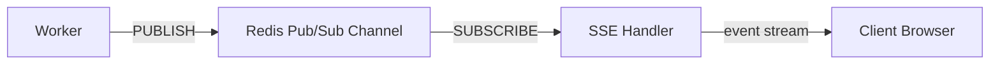
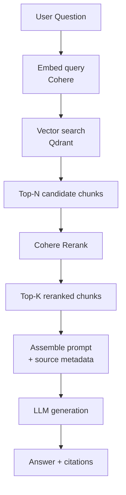
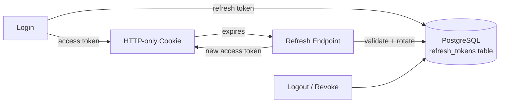

# FileAnalyzer — Architecture

A document Q&A platform in Go: upload documents, they're parsed, chunked, embedded, and indexed — then queried with RAG (retrieval-augmented generation) to get cited, source-backed answers.

**Stack:** Go · Chi Router · Redis Streams · Redis Pub/Sub · Qdrant · Cohere API · Backblaze S3 · PostgreSQL · SSE

---

## 1. High-Level Overview

Two independent flows share the same backbone: **ingestion** (get documents indexed) and **query** (RAG-based Q&A). Both lean on Chi for routing, PostgreSQL for durable state, and Redis for messaging.

---

## 2. Ingestion Pipeline (Fault-Tolerant Worker Flow)

**Reliability mechanisms:**
- **Exponential backoff** implemented with Redis Sorted Sets (score = next-retry timestamp) + Lua scripts for atomic claim-and-requeue.
- **Dead-letter queue** on max retries — failed jobs are quarantined, not lost.
- **Auto-claim** — if a consumer dies mid-job, any pending job idle over a minute is picked up by another worker (Redis Streams consumer group semantics), preventing stuck jobs.

---

## 3. Real-Time Status Updates (No Polling)

Instead of the frontend polling "is my document ready yet?", the worker publishes a completion event the moment processing finishes. An SSE endpoint subscribed to that channel pushes it straight to the client — near-instant feedback with far less load than polling.

---

## 4. RAG Query Flow

Two-stage retrieval — vector search casts a wide net, then Cohere Rerank sharpens precision before the chunks ever reach the LLM. This keeps the final context window small and relevant, which improves both answer quality and citation accuracy. Validated end-to-end on a document that produced 676 chunks with accurate, cited responses.

---

## 5. Auth & Session Lifecycle

- **Access tokens** live in HTTP-only cookies — inaccessible to client-side JS, mitigating XSS token theft.
- **Refresh tokens** are stored server-side in PostgreSQL with expiry timestamps and revocation tracking, enabling full session lifecycle control (rotate on use, revoke on logout, expire stale sessions).

---

## 6. Component Responsibilities

| Component | Responsibility |
|---|---|
| **Chi API** | Routing, dependency injection, repository pattern — decoupled, extensible codebase |
| **Backblaze S3** | Durable raw file storage |
| **Redis Streams (ingestion)** | Durable, replayable job queue with consumer groups |
| **Redis Streams (retry/DLQ)** | Sorted-set-based backoff scheduling + dead-letter handling |
| **Redis Pub/Sub** | Fire-and-forget "job done" notifications to SSE |
| **Cohere API** | Embedding generation + reranking |
| **Qdrant** | Vector storage and similarity search |
| **PostgreSQL** | Auth/session state, document & job metadata |
| **SSE Endpoint** | Push-based status updates to the frontend |

---

## 7. Key Design Decisions

- **Repository pattern + DI** — keeps business logic decoupled from Chi's routing layer and from storage backends, so swapping Qdrant or S3 later wouldn't touch handler code.
- **Streams over simple queues** — Redis Streams' consumer-group model gives at-least-once delivery *and* the auto-claim safety net for free, without a heavier broker.
- **Two-stage retrieval (search → rerank)** — cheaper vector search narrows candidates first; the more expensive rerank step only runs on a small candidate set.
- **Pub/Sub for notifications, Streams for work** — Streams guarantee delivery of jobs that must not be lost; Pub/Sub is used only for ephemeral "refresh your UI" signals, where losing a message is harmless since state lives in Postgres/Qdrant anyway.
